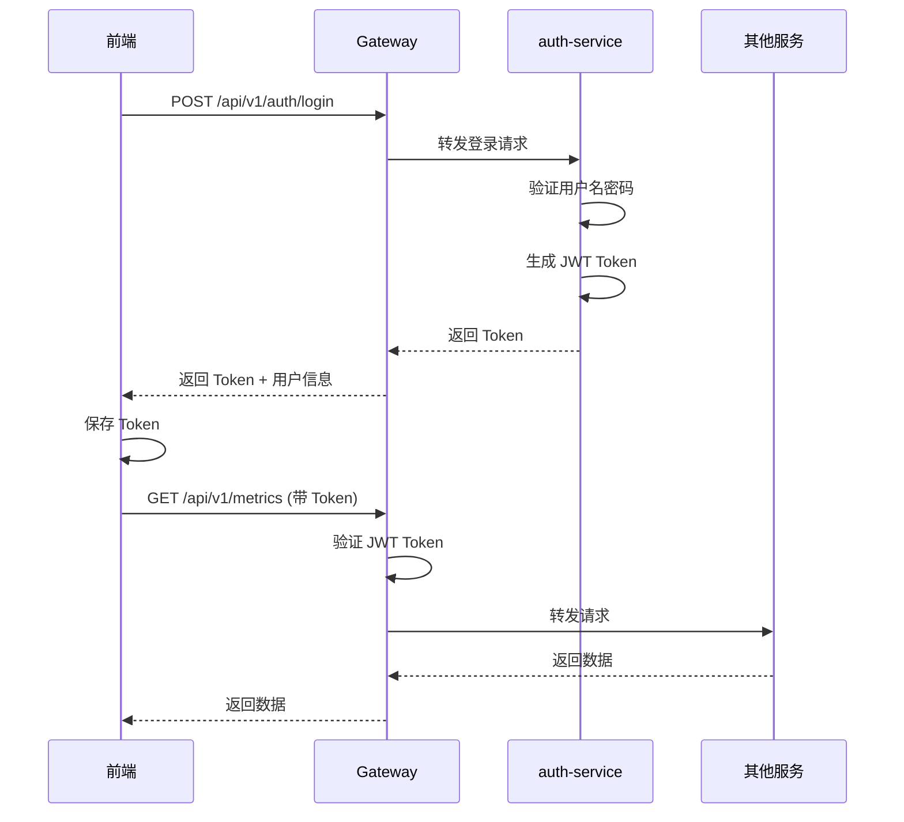

# 后台管理系统服务说明

## 概述

K8s Agent 系统新增了完整的后台管理功能,包含三个新的微服务:
- **监控管理服务** (monitor-service)
- **K8s集群管理服务** (cluster-service)
- **系统授权服务** (auth-service) - 已完善

配合现有的服务和 **API 网关** (gateway-service),形成完整的企业级管理平台。

---

## 🎯 新增微服务

### 1. 监控管理服务 (monitor-service)

**位置**: `monitor-service/`
**端口**: 8081 (HTTP), 9091 (Prometheus)

**功能**:
- ✅ 实时监控数据采集与聚合
- ✅ Agent/Event/Command 指标统计
- ✅ 告警规则管理 (邮件/Webhook/Slack)
- ✅ 仪表盘数据提供
- ✅ 趋势分析与异常检测
- ✅ Prometheus 指标暴露

**主要 API**:
```bash
GET  /api/v1/metrics/summary    # 监控概览
GET  /api/v1/metrics/agents     # Agent 指标
GET  /api/v1/metrics/trends     # 趋势数据
GET  /api/v1/alerts              # 告警规则列表
POST /api/v1/alerts              # 创建告警规则
GET  /api/v1/dashboard/overview # 仪表盘概览
```

**快速启动**:
```bash
cd monitor-service
make build && make run

# 或使用 Docker
make docker-build
docker run -p 8081:8081 k8s-agent/monitor-service
```

**配置**: `monitor-service/configs/config.yaml`

---

### 2. K8s集群管理服务 (cluster-service)

**位置**: `cluster-service/`
**端口**: 8082

**功能**:
- ✅ 多 K8s 集群接入与管理
- ✅ 集群健康检查与状态监控
- ✅ Pod/Deployment/Service 管理
- ✅ 资源统计与使用率监控
- ✅ 集群事件监控
- ✅ 应用部署与管理

**主要 API**:
```bash
# 集群管理
GET    /api/v1/clusters           # 集群列表
POST   /api/v1/clusters           # 添加集群
GET    /api/v1/clusters/:id/health # 集群健康
GET    /api/v1/clusters/:id/nodes  # 节点列表

# 资源管理
GET    /api/v1/clusters/:id/namespaces/:ns/pods        # Pod 列表
GET    /api/v1/clusters/:id/namespaces/:ns/deployments # Deployment 列表
POST   /api/v1/clusters/:id/namespaces/:ns/deployments # 创建 Deployment
GET    /api/v1/clusters/:id/stats                      # 集群统计
```

**快速启动**:
```bash
cd cluster-service
make build && make run

# 确保有 kubeconfig 访问权限
export KUBECONFIG=~/.kube/config
```

**配置**: `cluster-service/configs/config.yaml`

---

### 3. 系统授权服务 (auth-service) - 已完善

**位置**: `auth-service/`
**端口**: 8090

**功能**:
- ✅ JWT 认证与授权
- ✅ 用户管理 (CRUD)
- ✅ 角色管理 (RBAC)
- ✅ 权限管理 (菜单/按钮/API)
- ✅ API Key 管理
- ✅ 密码加密存储

**主要 API**:
```bash
POST   /api/v1/auth/login       # 用户登录
GET    /api/v1/auth/me          # 获取用户信息
GET    /api/v1/auth/menus       # 获取用户菜单
GET    /api/v1/users            # 用户列表
GET    /api/v1/roles            # 角色列表
GET    /api/v1/permissions      # 权限列表
```

**默认账号**:
```
用户名: admin
密码: admin123
```

**快速启动**:
```bash
cd auth-service
make build && make run
```

**配置**: `auth-service/configs/config.yaml`

---

## 🌐 API 网关 (gateway-service)

**位置**: `gateway-service/`
**端口**: 8080

**功能**:
- ✅ 统一 API 入口
- ✅ 请求路由转发
- ✅ JWT 认证验证
- ✅ 限流保护
- ✅ CORS 跨域处理
- ✅ 服务健康检查

**路由规则**:
```
/api/v1/auth/*      → auth-service:8090
/api/v1/users/*     → auth-service:8090
/api/v1/roles/*     → auth-service:8090
/api/v1/metrics/*   → monitor-service:8081
/api/v1/alerts/*    → monitor-service:8081
/api/v1/clusters/*  → cluster-service:8082
/api/v1/agents/*    → agent-manager:8080
/api/v1/events/*    → agent-manager:8080
/api/v1/workflows/* → orchestrator-service:8083
```

**快速启动**:
```bash
cd gateway-service
make build && make run
```

---

## 🎨 前端应用 (agent-manager-ui)

**位置**: `agent-manager-ui/`
**端口**: 3000 (开发), 80 (生产)

**新增功能**:
- ✅ 用户登录与认证
- ✅ 权限控制 (菜单/按钮级别)
- ✅ 用户管理界面
- ✅ 监控仪表盘
- ✅ 集群管理界面
- ✅ 告警配置界面

**技术栈**:
- Vue 3 + Composition API
- Ant Design Vue 4
- Pinia (状态管理)
- Axios (HTTP 客户端)
- VXETable (表格)

**快速启动**:
```bash
cd agent-manager-ui
npm install
npm run dev

# 访问 http://localhost:3000
```

**新增文件**:
```
src/
├── api/
│   ├── auth.js           # 认证 API
│   └── user.js           # 用户管理 API
├── store/
│   └── user.js           # 用户状态管理
├── views/
│   └── Login.vue         # 登录页面
└── directives/
    └── permission.js     # 权限指令
```

---

## 🚀 完整启动流程

### 方式一: Docker Compose (推荐)

```bash
# 启动所有服务
docker-compose -f docker-compose.backend.yml up -d

# 访问前端
open http://localhost:3000

# 默认账号: admin / admin123
```

### 方式二: 本地开发

#### 1. 启动基础设施

```bash
# PostgreSQL
docker run -d --name postgres -p 5432:5432 \
  -e POSTGRES_PASSWORD=postgres postgres:14-alpine

# Redis
docker run -d --name redis -p 6379:6379 redis:7-alpine

# NATS
docker run -d --name nats -p 4222:4222 nats:2.9-alpine
```

#### 2. 初始化数据库

```bash
psql -U postgres -h localhost -f scripts/init-databases.sql
```

#### 3. 启动后端服务

```bash
# 在不同 Terminal 中分别启动
cd auth-service && make run          # Terminal 1
cd monitor-service && make run       # Terminal 2
cd cluster-service && make run       # Terminal 3
cd agent-manager && make run         # Terminal 4 (如已运行可跳过)
cd orchestrator-service && make run  # Terminal 5 (如已运行可跳过)
cd gateway-service && make run       # Terminal 6
```

#### 4. 启动前端

```bash
cd agent-manager-ui && npm run dev   # Terminal 7
```

#### 5. 访问系统

打开浏览器: http://localhost:3000

---

## 📊 服务端口一览

| 服务 | HTTP 端口 | Metrics 端口 | 用途 |
|------|----------|--------------|------|
| auth-service | 8090 | - | 认证授权 |
| monitor-service | 8081 | 9091 | 监控管理 |
| cluster-service | 8082 | - | 集群管理 |
| agent-manager | 8080 | 9090 | Agent 管理 |
| orchestrator-service | 8083 | - | 工作流编排 |
| gateway-service | 8080 | - | API 网关 |
| agent-manager-ui | 3000/80 | - | 前端界面 |

**基础设施**:
- PostgreSQL: 5432
- Redis: 6379
- NATS: 4222 (client), 8222 (monitoring)

---

## 🔐 认证流程



---

## 📖 相关文档

- [架构设计文档](BACKEND_MANAGEMENT_ARCHITECTURE.md)
- [快速启动指南](QUICK_START_BACKEND.md)
- [auth-service 详细说明](auth-service/README.md)
- [monitor-service 详细说明](monitor-service/README.md)
- [cluster-service 详细说明](cluster-service/README.md)
- [gateway-service 详细说明](gateway-service/README.md)
- [agent-manager-ui 详细说明](agent-manager-ui/README.md)

---

## 🛠️ 开发指南

### 添加新的微服务

1. 创建服务目录结构
2. 实现业务逻辑
3. 在 gateway-service 添加路由规则
4. 更新 docker-compose.backend.yml
5. 更新文档

### 前端集成新功能

1. 在 `src/api/` 添加 API 接口
2. 在 `src/views/` 创建页面组件
3. 在 `src/router/` 添加路由
4. 在 layouts 添加菜单项

### 数据库迁移

```bash
# 创建迁移文件
migrate create -ext sql -dir migrations -seq init_schema

# 执行迁移
migrate -path migrations -database "postgresql://..." up
```

---

## 🐛 常见问题

### 1. 服务无法连接数据库

检查数据库是否启动,配置是否正确:
```bash
psql -U postgres -h localhost -l
```

### 2. 前端无法访问后端

确保网关正常运行,检查代理配置:
```bash
curl http://localhost:8080/health
```

### 3. 认证失败

检查 JWT secret 配置是否一致,Token 是否过期。

### 4. 权限不足

确保用户拥有对应的权限,检查角色权限配置。

---

## 📝 TODO

- [ ] OAuth 2.0 支持
- [ ] 单点登录 (SSO)
- [ ] 多因素认证 (MFA)
- [ ] 审计日志
- [ ] 数据导出功能
- [ ] 批量操作
- [ ] WebSocket 实时推送
- [ ] 移动端适配

---

## 🤝 贡献指南

欢迎提交 Issue 和 Pull Request!

## 📄 License

MIT
