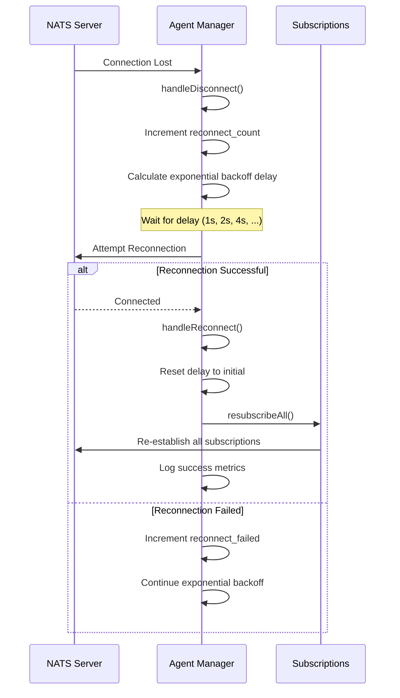

# NATS Reconnection Strategy

## Overview

The agent-manager service implements an enhanced NATS reconnection mechanism with exponential backoff strategy. This ensures reliable message delivery and automatic recovery from network failures.

## Features

### 1. Exponential Backoff

The reconnection delay increases exponentially with each failed attempt:

- **Initial Delay**: 1 second (configurable)
- **Maximum Delay**: 30 seconds (configurable)
- **Backoff Factor**: 2.0 (each retry doubles the delay)

**Example progression**:
- Attempt 1: 1s
- Attempt 2: 2s
- Attempt 3: 4s
- Attempt 4: 8s
- Attempt 5: 16s
- Attempt 6+: 30s (capped at max)

### 2. Automatic Subscription Recovery

When reconnection succeeds, all NATS subscriptions are automatically re-established:

- Agent registration (`aetherius.agent.*.register`)
- Agent heartbeat (`aetherius.agent.*.heartbeat`)
- Agent events (`aetherius.agent.*.event`)
- Agent metrics (`aetherius.agent.*.metrics`)
- Command results (`aetherius.agent.*.result`)

### 3. Comprehensive Metrics

The system tracks reconnection statistics:

- `reconnect_count`: Total number of disconnections
- `reconnect_success`: Successful reconnections
- `reconnect_failed`: Failed reconnection attempts
- `last_reconnect_time`: Timestamp of last successful reconnection
- `current_reconnect_delay`: Current backoff delay

### 4. Enhanced Logging

All reconnection events are logged with context:

```log
WARN  Disconnected from NATS | error=... reconnect_count=1 next_delay=2s
INFO  Calculating reconnect delay | attempt=2 delay=2s max_delay=30s
INFO  Reconnected to NATS | url=nats://localhost:4222 reconnect_count=1 success_count=1
INFO  Resubscribing to all subjects after reconnection
INFO  Successfully resubscribed to all subjects | subscription_count=5
```

## Configuration

### Environment Variables

```bash
# NATS URL
export NATS_URL="nats://localhost:4222"

# Basic reconnection settings
export NATS_MAX_RECONNECT=10          # -1 for unlimited retries
export NATS_RECONNECT_WAIT=2s         # Base reconnect wait (not used with custom backoff)

# Exponential backoff settings (NEW)
export NATS_RECONNECT_DELAY_INITIAL=1s    # Initial delay
export NATS_RECONNECT_DELAY_MAX=30s       # Maximum delay
export NATS_RECONNECT_BACKOFF_FACTOR=2.0  # Exponential growth factor

# Connection health
export NATS_PING_INTERVAL=20s
export NATS_MAX_PINGS_OUT=2
```

### Command-Line Flags

```bash
./agent-manager \
  --nats.url=nats://localhost:4222 \
  --nats.max-reconnect=10 \
  --nats.reconnect-delay-initial=1s \
  --nats.reconnect-delay-max=30s \
  --nats.reconnect-backoff-factor=2.0
```

### YAML Configuration

```yaml
nats:
  url: "nats://localhost:4222"
  max_reconnect: 10
  reconnect_wait: 2s
  ping_interval: 20s
  max_pings_out: 2
  enable_jetstream: false
  reconnect_buf_size: 1048576  # 1MB
  # Exponential backoff settings
  reconnect_delay_initial: 1s
  reconnect_delay_max: 30s
  reconnect_backoff_factor: 2.0
```

## Implementation Details

### Reconnection Flow



### Code Structure

**Server Options** (`internal/agent-manager/nats/server.go`):
```go
type ServerOptions struct {
    reconnectDelayMax      time.Duration  // Maximum backoff delay
    reconnectDelayInitial  time.Duration  // Initial backoff delay
    reconnectBackoffFactor float64        // Exponential growth factor
}
```

**Server State** (`internal/agent-manager/nats/server.go`):
```go
type Server struct {
    reconnectCount        int64          // Total disconnections
    reconnectSuccess      int64          // Successful reconnections
    reconnectFailed       int64          // Failed reconnections
    lastReconnectTime     time.Time      // Last successful reconnect
    currentReconnectDelay time.Duration  // Current backoff delay
}
```

**Key Functions**:

1. `customReconnectDelay(attempts int)`: Calculates exponential backoff
2. `handleDisconnect(conn, err)`: Logs disconnection events
3. `handleReconnect(conn)`: Handles successful reconnection
4. `resubscribeAll()`: Recovers all subscriptions
5. `GetStatistics()`: Returns reconnection metrics

## Monitoring

### Health Check Endpoint

```bash
curl http://localhost:8080/health
```

Returns NATS connection status and metrics.

### Statistics Endpoint

```bash
curl http://localhost:8080/api/v1/nats/stats
```

Returns detailed reconnection statistics:

```json
{
  "connected": true,
  "connected_url": "nats://localhost:4222",
  "messages_received": 1523,
  "messages_sent": 842,
  "error_count": 3,
  "subscription_count": 5,
  "reconnect_count": 2,
  "reconnect_success": 2,
  "reconnect_failed": 0,
  "last_reconnect_time": "2025-11-06T10:23:45Z",
  "current_reconnect_delay": "1s"
}
```

## Testing

### Simulate Network Failure

```bash
# Stop NATS server
docker-compose stop nats

# Watch agent-manager logs
tail -f /var/log/agent-manager.log

# Restart NATS server
docker-compose start nats

# Verify reconnection and subscription recovery
```

### Expected Behavior

1. **Disconnection Detected**: `WARN Disconnected from NATS`
2. **Exponential Backoff**: Delays increase (1s, 2s, 4s, 8s, 16s, 30s)
3. **Reconnection Success**: `INFO Reconnected to NATS`
4. **Subscription Recovery**: `INFO Successfully resubscribed to all subjects`
5. **Metrics Updated**: Reconnection counters incremented

## Best Practices

### 1. Unlimited Retries for Production

```yaml
nats:
  max_reconnect: -1  # Never give up
```

### 2. Reasonable Backoff Limits

```yaml
nats:
  reconnect_delay_initial: 1s   # Start quickly
  reconnect_delay_max: 30s      # Don't wait too long
  reconnect_backoff_factor: 2.0 # Standard exponential backoff
```

### 3. Monitor Reconnection Metrics

Set up alerts for:
- High `reconnect_count` (> 10/hour)
- High `reconnect_failed` ratio
- Long `current_reconnect_delay` periods

### 4. Connection Health Checks

```yaml
nats:
  ping_interval: 20s      # Detect failures quickly
  max_pings_out: 2        # Tolerate brief network issues
```

## Troubleshooting

### Problem: Frequent Disconnections

**Symptoms**: High `reconnect_count`, many disconnect logs

**Solutions**:
1. Check network stability between agent-manager and NATS
2. Increase `ping_interval` to reduce sensitivity
3. Increase `max_pings_out` to tolerate brief outages
4. Verify NATS server health and resource availability

### Problem: Failed Reconnections

**Symptoms**: `reconnect_failed` increasing, no successful reconnections

**Solutions**:
1. Verify NATS server is running and accessible
2. Check firewall rules and network policies
3. Verify NATS URL configuration
4. Check NATS server logs for errors
5. Ensure `max_reconnect` is not too low (use -1 for unlimited)

### Problem: Subscription Loss After Reconnection

**Symptoms**: No messages received after reconnection

**Solutions**:
1. Check `resubscribeAll()` logs for errors
2. Verify subscription setup logic
3. Check NATS server permissions
4. Ensure subscriptions are not timing out during reconnection

### Problem: Excessive Backoff Delays

**Symptoms**: `current_reconnect_delay` stuck at maximum

**Solutions**:
1. Reduce `reconnect_delay_max` if recovery needs to be faster
2. Check why NATS is unavailable for extended periods
3. Consider load balancing across multiple NATS servers
4. Implement circuit breaker pattern if appropriate

## Performance Considerations

### Memory Impact

- **Subscription State**: Minimal (5 subscriptions × ~100 bytes each)
- **Metrics**: ~64 bytes (counters and timestamps)
- **Backoff State**: ~24 bytes (delay duration)

**Total**: < 1 KB per NATS server instance

### CPU Impact

- **Reconnection Logic**: Negligible (only during disconnection events)
- **Exponential Calculation**: O(1) per reconnection attempt
- **Subscription Recovery**: O(n) where n = number of subscriptions (typically 5)

### Network Impact

- **Heartbeat Traffic**: ~100 bytes every 20 seconds
- **Reconnection Attempts**: ~1 KB per attempt
- **Subscription Reestablishment**: ~500 bytes per subscription

## Future Enhancements

1. **Circuit Breaker**: Temporarily stop reconnection attempts after threshold
2. **Jitter**: Add random jitter to backoff to prevent thundering herd
3. **Adaptive Backoff**: Adjust backoff based on historical success rates
4. **Connection Pooling**: Multiple NATS connections for high availability
5. **Metrics Export**: Prometheus metrics for reconnection events

## References

- [NATS Go Client Documentation](https://github.com/nats-io/nats.go)
- [Exponential Backoff Algorithm](https://en.wikipedia.org/wiki/Exponential_backoff)
- [Circuit Breaker Pattern](https://martinfowler.com/bliki/CircuitBreaker.html)
- [docs/CODE_REDUNDANCY_ANALYSIS.md](./CODE_REDUNDANCY_ANALYSIS.md) - Original TODO item
