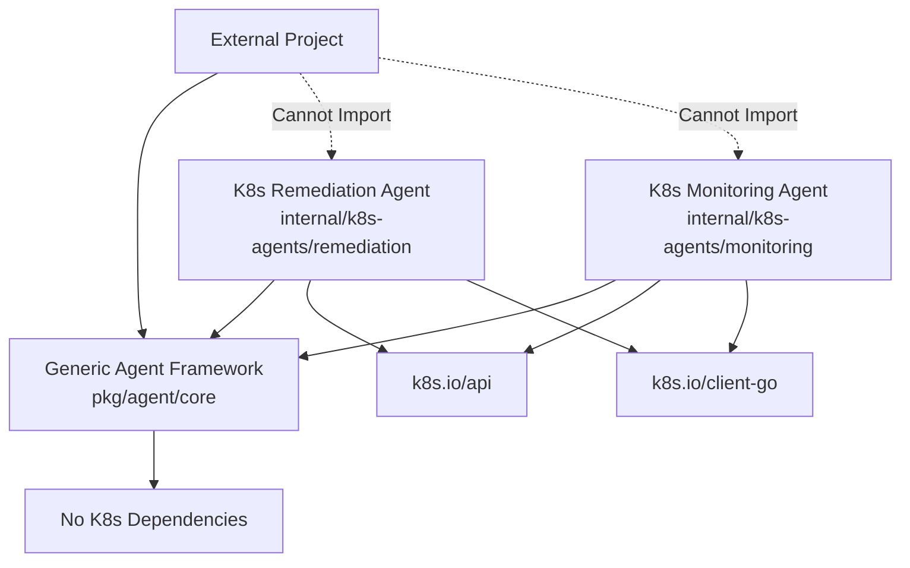

# K8s Agent Architecture - Separation of Concerns

## Overview

The agent architecture is designed with clear separation between:
- **Generic Agent Framework** (`pkg/agent/`) - Reusable AI agent framework
- **K8s-Specific Agents** (`internal/k8s-agents/`) - Kubernetes-specific implementations

## Directory Structure

```
k8s-agent/
├── pkg/agent/                      # Generic, reusable agent framework
│   ├── core.go                     # Core interfaces and types
│   ├── base.go                     # Base agent implementation
│   ├── planning.go                 # Planning strategies
│   ├── memory.go                   # Memory storage systems
│   ├── reflection.go               # Reflection and learning
│   ├── toolbox.go                  # Tool management
│   └── mcp_toolbox.go              # Model Context Protocol toolbox
│
└── internal/k8s-agents/            # K8s-specific agent implementations
    ├── remediation/                # Automated remediation agent
    │   └── agent.go
    ├── monitoring/                 # Monitoring and alerting agent
    │   └── agent.go
    ├── analysis/                   # Analysis and diagnostics agent
    │   └── agent.go
    └── workflow/                   # Workflow orchestration agent
        └── agent.go
```

## Architecture Principles

### 1. Generic Framework (`pkg/agent/`)

The generic framework provides:
- **Reusability**: Can be imported by any Go project
- **Extensibility**: Interface-based design for custom implementations
- **Zero K8s Dependencies**: No Kubernetes-specific imports
- **Pluggable Components**: Memory, planning, tools are all pluggable

### 2. K8s-Specific Implementation (`internal/k8s-agents/`)

K8s-specific agents:
- **Import Generic Framework**: Build upon `pkg/agent` interfaces
- **K8s Integration**: Direct integration with Kubernetes APIs
- **Domain Logic**: Contain K8s-specific business logic
- **Not Reusable Outside**: Internal to this project

## Usage Examples

### Using Generic Framework in Another Project

```go
import "github.com/kart-io/k8s-agent/pkg/agent/core"

// Create custom agent implementing the core.Agent interface
type MyCustomAgent struct {
    name        string
    description string
    // Your custom fields
}

func NewMyCustomAgent() *MyCustomAgent {
    return &MyCustomAgent{
        name:        "my-agent",
        description: "My custom agent",
    }
}

// Implement core.Agent interface
func (a *MyCustomAgent) Execute(ctx context.Context, input *core.AgentInput) (*core.AgentOutput, error) {
    // Your implementation
    return &core.AgentOutput{
        Status:  "success",
        Result:  "processed",
        Message: "Task completed",
    }, nil
}

func (a *MyCustomAgent) Name() string { return a.name }
func (a *MyCustomAgent) Description() string { return a.description }
func (a *MyCustomAgent) Capabilities() []string { return []string{"custom"} }
```

### Using K8s-Specific Agent

```go
import (
    "github.com/kart-io/k8s-agent/internal/k8s-agents/remediation"
    "k8s.io/client-go/kubernetes"
)

// Use K8s remediation agent
k8sClient := kubernetes.NewForConfig(config) // Your K8s client
remediationAgent := remediation.NewK8sRemediationAgent(k8sClient, "default", logger)

// The agent implements core.Agent interface
input := &core.AgentInput{
    Task: "Fix OOM Kill issue",
    Context: map[string]interface{}{
        "issue": remediation.K8sIssue{
            Type:     remediation.IssueTypeOOMKill,
            Resource: remediation.K8sResource{
                Kind:      "Pod",
                Name:      "my-pod",
                Namespace: "default",
            },
        },
    },
}

output, err := remediationAgent.Execute(ctx, input)
```

## Component Dependencies



## Benefits of Separation

### 1. Reusability
- Generic framework can be used in any Go project
- No forced K8s dependencies for non-K8s use cases

### 2. Maintainability
- Clear boundaries between generic and specific code
- Easier to test generic components in isolation

### 3. Scalability
- New K8s agents can be added without modifying framework
- Framework improvements benefit all agents

### 4. Security
- Internal K8s agents are not exposed as public API
- Generic framework has minimal attack surface

## Migration from Mixed Architecture

If you have existing mixed code:

1. **Identify Generic Components**
   - Interfaces without K8s types
   - Logic that could work with any backend
   - Utility functions

2. **Move to `pkg/agent/`**
   ```bash
   # Example: Move generic planning logic
   mv internal/agent/planning.go pkg/agent/planning.go
   ```

3. **Create K8s Wrapper**
   ```go
   // internal/k8s-agents/planner/k8s_planner.go
   type K8sPlanner struct {
       agent.Planner  // Embed generic interface
       k8sClient *kubernetes.Client
   }
   ```

4. **Update Imports**
   ```go
   // Before
   import "internal/agent"

   // After
   import "github.com/kart-io/k8s-agent/pkg/agent"
   ```

## Adding New K8s Agents

To add a new K8s-specific agent:

1. Create directory: `internal/k8s-agents/your-agent/`

2. Implement agent:
```go
package youragent

import (
    "github.com/kart-io/k8s-agent/pkg/agent"
    "k8s.io/client-go/kubernetes"
)

type YourK8sAgent struct {
    *agent.BaseAgent
    k8sClient *kubernetes.Client
}

func NewYourK8sAgent(client *kubernetes.Client) *YourK8sAgent {
    return &YourK8sAgent{
        BaseAgent: agent.NewBaseAgent("Your Agent", "Description"),
        k8sClient: client,
    }
}

// Implement K8s-specific methods...
```

3. Register with agent manager if needed

## Testing Strategy

### Generic Framework Tests
```go
// pkg/agent/planning_test.go
func TestPlanner(t *testing.T) {
    // Test without K8s dependencies
    planner := NewSimplePlanner(config, logger)
    // ...
}
```

### K8s Agent Tests
```go
// internal/k8s-agents/remediation/agent_test.go
func TestK8sRemediation(t *testing.T) {
    // Use fake K8s client
    fakeClient := fake.NewSimpleClientset()
    agent := NewK8sRemediationAgent(fakeClient, "test", logger)
    // ...
}
```

## Performance Considerations

### Generic Framework
- Minimal overhead
- No network calls
- Memory-efficient interfaces

### K8s Agents
- K8s API rate limiting aware
- Caching for frequent operations
- Async processing where possible

## Future Enhancements

1. **Plugin System**: Dynamic loading of agents
2. **Agent Registry**: Central registration and discovery
3. **Cross-Agent Communication**: Event bus for agent coordination
4. **Metrics Collection**: Unified metrics across all agents

## Conclusion

This separation ensures the agent framework remains:
- **Generic and Reusable**: Can be used outside K8s context
- **Clean and Maintainable**: Clear boundaries
- **Extensible**: Easy to add new agents
- **Testable**: Components can be tested in isolation