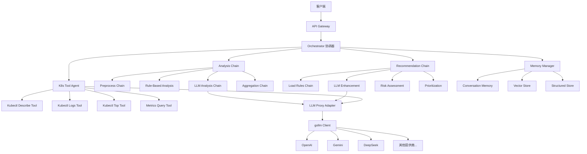
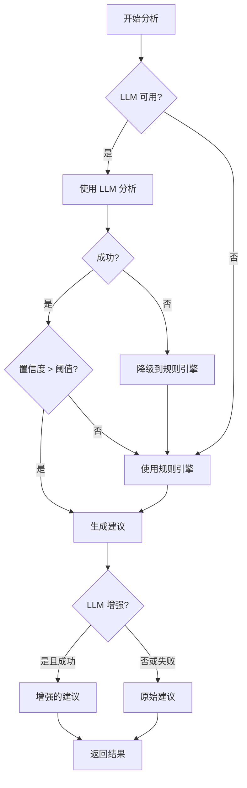

# 设计文档: Reasoning Service 重构

## 概述

本设计文档描述了基于 go-llm-proxy (gollm) 和 LangChainGo 重构 Reasoning Service 的技术实现方案。重构采用模块化架构,将 LLM 访问、推理链、工具调用和记忆管理分离为独立模块,提高系统的可维护性和可扩展性。

### 设计目标

1. 使用 gollm 统一 LLM 访问接口,简化多提供商集成
2. 使用 LangChainGo 实现可组合的推理链
3. 实现智能 Agent 支持工具调用
4. 集成向量数据库实现相似案例检索
5. 保持 API 向后兼容性
6. 支持功能开关实现平滑迁移

## 架构设计

### 整体架构图



### 模块职责

#### 1. LLM Proxy Adapter

**职责**: 封装 gollm 提供统一的 LLM 访问接口

**关键功能**:
- 从配置加载提供商列表并按优先级排序
- 实现统一的 Complete() 接口
- 自动故障转移到备用提供商
- 成本跟踪和使用统计
- 提供商健康检查

#### 2. LangChain Chains

**职责**: 实现可组合的推理链

**Analysis Chain**:
- PreprocessChain: 数据清洗和格式化
- RuleBasedAnalysis: 基于正则表达式的快速匹配
- LLMAnalysisChain: LLM 深度分析
- AggregationChain: 结果聚合和置信度计算

**Recommendation Chain**:
- LoadRulesChain: 加载预定义建议模板
- LLMEnhancementChain: 使用 LLM 增强建议描述
- RiskAssessmentChain: 评估建议的风险级别
- PrioritizationChain: 根据置信度和风险排序

#### 3. K8s Tool Agent

**职责**: 使用 LLM 决策并调用 K8s 工具

**工具列表**:
- KubectlDescribeTool: 获取资源详细信息
- KubectlLogsTool: 获取 Pod 日志
- KubectlTopTool: 获取资源使用情况
- MetricsQueryTool: 查询 Prometheus 指标

#### 4. Memory Manager

**职责**: 管理对话历史和分析结果

**存储类型**:
- ConversationMemory: 短期对话记忆
- VectorStore: 向量相似度检索 (Chroma)
- StructuredStore: 结构化历史数据

#### 5. Orchestrator

**职责**: 协调所有模块完成分析流程

**执行流程**:
1. 加载历史上下文和相似案例
2. 执行分析链
3. 可选调用工具 Agent
4. 生成建议
5. 保存结果到记忆

## 组件和接口

### 1. LLM Proxy Adapter

#### 接口定义

```go
// pkg/llm/proxy/adapter.go
package proxy

import (
    "context"
    "time"
    "reasoning-service-go/internal/config"
)

// ProxyAdapter 封装 gollm 提供统一接口
type ProxyAdapter struct {
    providers []*ProviderClient
    config    *config.LLMConfig
    metrics   *UsageMetrics
}

// ProviderClient 单个提供商客户端
type ProviderClient struct {
    name     string
    priority int
    client   interface{} // gollm.LLM
    config   *config.LLMProviderConfig
    healthy  bool
}

// NewProxyAdapter 创建新的代理适配器
func NewProxyAdapter(cfg *config.LLMConfig) (*ProxyAdapter, error)

// Complete 标准的补全请求
func (a *ProxyAdapter) Complete(ctx context.Context, req *CompletionRequest) (*CompletionResponse, error)

// GetMetrics 获取使用指标
func (a *ProxyAdapter) GetMetrics() *UsageMetrics

// GetProviderStatus 获取所有提供商状态
func (a *ProxyAdapter) GetProviderStatus() map[string]ProviderStatus
```

#### 数据结构

```go
type CompletionRequest struct {
    Messages    []Message
    Temperature float64
    MaxTokens   int
    StopWords   []string
}

type Message struct {
    Role    string // "system", "user", "assistant"
    Content string
}

type CompletionResponse struct {
    Content      string
    Provider     string
    Model        string
    TokensUsed   int
    Cost         float64
    Latency      time.Duration
    FinishReason string
}

type UsageMetrics struct {
    TotalRequests   int
    SuccessfulCalls int
    FailedCalls     int
    TotalCost       float64
    ProviderStats   map[string]ProviderMetrics
}

type ProviderMetrics struct {
    Calls       int
    Successes   int
    Failures    int
    TotalCost   float64
    AvgLatency  time.Duration
}

type ProviderStatus struct {
    Name      string
    Healthy   bool
    LastError string
    LastCheck time.Time
}
```

#### 实现逻辑

```go
func (a *ProxyAdapter) Complete(ctx context.Context, req *CompletionRequest) (*CompletionResponse, error) {
    // 1. 遍历按优先级排序的提供商
    for _, provider := range a.providers {
        if !provider.healthy {
            continue
        }

        // 2. 构建 gollm 请求
        gollmReq := a.buildGollmRequest(req, provider.config)

        // 3. 调用 gollm
        start := time.Now()
        response, err := provider.client.Generate(ctx, gollmReq)
        latency := time.Since(start)

        // 4. 成功则返回
        if err == nil {
            a.recordSuccess(provider.name, latency, response)
            return a.buildResponse(response, provider, latency), nil
        }

        // 5. 失败则记录并尝试下一个
        a.recordFailure(provider.name, err)
        log.Printf("Provider %s failed: %v, trying next...", provider.name, err)
    }

    return nil, fmt.Errorf("all providers failed")
}
```

### 2. Analysis Chain

#### 接口定义

```go
// internal/chains/analysis_chain.go
package chains

import (
    "context"
    "github.com/tmc/langchaingo/llms"
    "github.com/tmc/langchaingo/memory"
    "reasoning-service-go/pkg/types"
)

// AnalysisChain 根因分析链
type AnalysisChain struct {
    llm          llms.LLM
    memory       memory.Memory
    preprocessor *PreprocessChain
    ruleEngine   *RuleBasedAnalysis
    llmAnalyzer  *LLMAnalysisChain
    aggregator   *AggregationChain
}

// NewAnalysisChain 创建分析链
func NewAnalysisChain(llm llms.LLM, mem memory.Memory) *AnalysisChain

// Run 执行分析链
func (c *AnalysisChain) Run(ctx context.Context, input AnalysisInput) (*AnalysisOutput, error)

// AnalysisInput 分析输入
type AnalysisInput struct {
    Request      *types.AnalysisRequest
    History      []memory.ChatMessage
    SimilarCases []types.CaseStudy
}

// AnalysisOutput 分析输出
type AnalysisOutput struct {
    RootCause           *types.RootCause
    Confidence          float64
    Evidence            []string
    NeedsMoreInfo       bool
    ToolRequest         string
    LLMAnalysis         string
    IntermediateResults map[string]interface{}
}
```

#### 子链定义

```go
// PreprocessChain 数据预处理
type PreprocessChain struct{}

type PreprocessedData struct {
    Event   map[string]interface{}
    Logs    string
    Metrics *types.MetricsData
    Context *types.AnalysisContext
}

func (c *PreprocessChain) Process(ctx context.Context, input AnalysisInput) (*PreprocessedData, error)

// RuleBasedAnalysis 基于规则的分析
type RuleBasedAnalysis struct {
    patterns map[types.RootCauseType][]*regexp.Regexp
}

func (a *RuleBasedAnalysis) Analyze(ctx context.Context, data *PreprocessedData) (*AnalysisOutput, error)

// LLMAnalysisChain LLM 分析链
type LLMAnalysisChain struct {
    proxyAdapter *proxy.ProxyAdapter
    promptTpl    string
}

func (c *LLMAnalysisChain) Analyze(ctx context.Context, data *PreprocessedData, hint *AnalysisOutput) (*AnalysisOutput, error)

// AggregationChain 结果聚合
type AggregationChain struct{}

func (c *AggregationChain) Aggregate(ctx context.Context, results ...*AnalysisOutput) (*AnalysisOutput, error)
```

#### 执行流程

```go
func (c *AnalysisChain) Run(ctx context.Context, input AnalysisInput) (*AnalysisOutput, error) {
    // 1. 预处理
    preprocessed, err := c.preprocessor.Process(ctx, input)
    if err != nil {
        return nil, err
    }

    // 2. 规则匹配 (快速路径)
    ruleResult, err := c.ruleEngine.Analyze(ctx, preprocessed)
    if err == nil && ruleResult.Confidence > 0.8 {
        // 高置信度,直接返回
        return ruleResult, nil
    }

    // 3. LLM 深度分析
    llmResult, err := c.llmAnalyzer.Analyze(ctx, preprocessed, ruleResult)
    if err != nil {
        // LLM 失败,降级使用规则结果
        if ruleResult != nil {
            return ruleResult, nil
        }
        return nil, err
    }

    // 4. 聚合结果
    finalResult, err := c.aggregator.Aggregate(ctx, ruleResult, llmResult)
    if err != nil {
        return nil, err
    }

    return finalResult, nil
}
```

### 3. Recommendation Chain

#### 接口定义

```go
// internal/chains/recommendation_chain.go
package chains

// RecommendationChain 建议生成链
type RecommendationChain struct {
    proxyAdapter *proxy.ProxyAdapter
    ruleEngine   *recommender.Engine
}

// NewRecommendationChain 创建建议链
func NewRecommendationChain(adapter *proxy.ProxyAdapter, rules *recommender.Engine) *RecommendationChain

// Run 执行建议链
func (c *RecommendationChain) Run(ctx context.Context, input RecommendationInput) ([]types.Recommendation, error)

// RecommendationInput 建议输入
type RecommendationInput struct {
    RootCause *types.RootCause
    Context   types.AnalysisContext
    History   []memory.ChatMessage
}
```

#### 执行流程

```go
func (c *RecommendationChain) Run(ctx context.Context, input RecommendationInput) ([]types.Recommendation, error) {
    // 1. 加载规则模板
    ruleRecs := c.ruleEngine.GetRecommendations(input.RootCause.Type)

    // 2. LLM 增强 (可选)
    enhancedRecs := ruleRecs
    if c.proxyAdapter != nil {
        enhanced, err := c.enhanceWithLLM(ctx, ruleRecs, input)
        if err == nil {
            enhancedRecs = enhanced
        }
    }

    // 3. 风险评估
    for i := range enhancedRecs {
        enhancedRecs[i].Risk = c.assessRisk(&enhancedRecs[i])
    }

    // 4. 优先级排序
    sortedRecs := c.prioritize(enhancedRecs)

    // 5. 限制数量
    if len(sortedRecs) > maxRecommendations {
        sortedRecs = sortedRecs[:maxRecommendations]
    }

    return sortedRecs, nil
}
```

### 4. K8s Tool Agent

#### 接口定义

```go
// internal/agents/k8s_tool_agent.go
package agents

import (
    "context"
    "github.com/tmc/langchaingo/agents"
    "github.com/tmc/langchaingo/tools"
    "k8s.io/client-go/kubernetes"
)

// K8sToolAgent K8s 工具调用 Agent
type K8sToolAgent struct {
    proxyAdapter *proxy.ProxyAdapter
    k8sClient    *kubernetes.Clientset
    tools        []tools.Tool
    executor     agents.Executor
}

// NewK8sToolAgent 创建 K8s Tool Agent
func NewK8sToolAgent(adapter *proxy.ProxyAdapter, k8sClient *kubernetes.Clientset) *K8sToolAgent

// Execute 执行任务
func (a *K8sToolAgent) Execute(ctx context.Context, task string) (*ExecutionResult, error)

// ExecutionResult Agent 执行结果
type ExecutionResult struct {
    Output    string
    ToolsUsed []string
    Reasoning string
}
```

#### 工具实现

```go
// KubectlDescribeTool 获取资源详细信息
type KubectlDescribeTool struct {
    k8sClient *kubernetes.Clientset
}

func (t *KubectlDescribeTool) Name() string {
    return "kubectl_describe"
}

func (t *KubectlDescribeTool) Description() string {
    return "Get detailed information about a Kubernetes resource. Input format: 'resource_type/resource_name', e.g., 'pod/nginx-xxx'"
}

func (t *KubectlDescribeTool) Call(ctx context.Context, input string) (string, error) {
    // 解析资源类型和名称
    parts := strings.Split(input, "/")
    if len(parts) != 2 {
        return "", fmt.Errorf("invalid input format")
    }

    resourceType := parts[0]
    resourceName := parts[1]

    // 调用 K8s API
    switch resourceType {
    case "pod":
        pod, err := t.k8sClient.CoreV1().Pods(namespace).Get(ctx, resourceName, metav1.GetOptions{})
        if err != nil {
            return "", err
        }
        return formatPodInfo(pod), nil
    // ... 其他资源类型
    }

    return "", fmt.Errorf("unsupported resource type: %s", resourceType)
}
```

### 5. Memory Manager

#### 接口定义

```go
// internal/memory/manager.go
package memory

import (
    "context"
    "github.com/tmc/langchaingo/memory"
    "github.com/tmc/langchaingo/vectorstores"
    "reasoning-service-go/pkg/types"
)

// MemoryManager 记忆管理器
type MemoryManager struct {
    conversationMemory memory.ConversationBufferMemory
    vectorStore        vectorstores.VectorStore
    structuredStore    *StructuredMemoryStore
    embedder           Embedder
}

// NewMemoryManager 创建记忆管理器
func NewMemoryManager(vectorStore vectorstores.VectorStore, embedder Embedder) *MemoryManager

// SaveAnalysis 保存分析结果
func (m *MemoryManager) SaveAnalysis(ctx context.Context, result *types.AnalysisResult) error

// FindSimilarCases 查找相似案例
func (m *MemoryManager) FindSimilarCases(ctx context.Context, query types.AnalysisContext) ([]types.CaseStudy, error)

// GetConversationHistory 获取对话历史
func (m *MemoryManager) GetConversationHistory(ctx context.Context, sessionID string) ([]memory.ChatMessage, error)
```

#### 实现逻辑

```go
func (m *MemoryManager) SaveAnalysis(ctx context.Context, result *types.AnalysisResult) error {
    // 1. 保存到对话记忆
    m.conversationMemory.SaveContext(ctx, map[string]any{
        "input":  result.RequestID,
        "output": result.Result,
    })

    // 2. 保存到向量存储
    text := m.formatAnalysisText(result)
    embedding, err := m.embedder.EmbedText(ctx, text)
    if err != nil {
        log.Printf("Failed to generate embedding: %v", err)
    } else {
        doc := schema.Document{
            PageContent: text,
            Metadata: map[string]any{
                "request_id": result.RequestID,
                "root_cause": result.Result.RootCause.Type,
                "confidence": result.Result.Confidence,
                "timestamp":  time.Now(),
            },
        }
        m.vectorStore.AddDocuments(ctx, []schema.Document{doc})
    }

    // 3. 保存到结构化存储
    m.structuredStore.Save(result)

    return nil
}

func (m *MemoryManager) FindSimilarCases(ctx context.Context, query types.AnalysisContext) ([]types.CaseStudy, error) {
    // 1. 构建查询文本
    queryText := m.formatQueryText(query)

    // 2. 向量相似度搜索
    docs, err := m.vectorStore.SimilaritySearch(ctx, queryText, 5)
    if err != nil {
        // 降级到结构化搜索
        return m.structuredStore.FindSimilar(query), nil
    }

    // 3. 转换为案例
    var cases []types.CaseStudy
    for _, doc := range docs {
        case := m.documentToCase(doc)
        cases = append(cases, case)
    }

    return cases, nil
}
```

### 6. Orchestrator

#### 接口定义

```go
// internal/orchestrator/orchestrator.go
package orchestrator

import (
    "context"
    "reasoning-service-go/internal/chains"
    "reasoning-service-go/internal/agents"
    "reasoning-service-go/internal/memory"
    "reasoning-service-go/pkg/types"
)

// Orchestrator 协调器
type Orchestrator struct {
    analysisChain       *chains.AnalysisChain
    recommendationChain *chains.RecommendationChain
    toolAgent           *agents.K8sToolAgent
    memoryManager       *memory.MemoryManager
    config              *config.Config
}

// NewOrchestrator 创建协调器
func NewOrchestrator(
    analysisChain *chains.AnalysisChain,
    recommendationChain *chains.RecommendationChain,
    toolAgent *agents.K8sToolAgent,
    memoryManager *memory.MemoryManager,
    config *config.Config,
) *Orchestrator

// AnalyzeRootCause 执行根因分析
func (o *Orchestrator) AnalyzeRootCause(ctx context.Context, req *types.AnalysisRequest) (*types.AnalysisResult, error)
```

#### 执行流程

```go
func (o *Orchestrator) AnalyzeRootCause(ctx context.Context, req *types.AnalysisRequest) (*types.AnalysisResult, error) {
    start := time.Now()

    // 1. 加载上下文
    history, _ := o.memoryManager.GetConversationHistory(ctx, req.SessionID)
    similarCases, _ := o.memoryManager.FindSimilarCases(ctx, req.Context)

    // 2. 执行分析链
    analysisInput := chains.AnalysisInput{
        Request:      req,
        History:      history,
        SimilarCases: similarCases,
    }

    analysisOutput, err := o.analysisChain.Run(ctx, analysisInput)
    if err != nil {
        return o.buildErrorResult(req.RequestID, err), nil
    }

    // 3. 可选调用 Agent
    if analysisOutput.NeedsMoreInfo && o.toolAgent != nil {
        toolResult, err := o.toolAgent.Execute(ctx, analysisOutput.ToolRequest)
        if err == nil {
            analysisOutput = o.mergeToolResults(analysisOutput, toolResult)
        }
    }

    // 4. 生成建议
    recommendationInput := chains.RecommendationInput{
        RootCause: analysisOutput.RootCause,
        Context:   req.Context,
        History:   history,
    }

    recommendations, err := o.recommendationChain.Run(ctx, recommendationInput)
    if err != nil {
        // 降级到规则引擎
        log.Printf("RecommendationChain failed: %v, using fallback", err)
        recommendations = o.getFallbackRecommendations(analysisOutput.RootCause)
    }

    // 5. 构建结果
    result := &types.AnalysisResult{
        RequestID: req.RequestID,
        Status:    "completed",
        Result: &types.DetailedResult{
            RootCause:       analysisOutput.RootCause,
            Recommendations: recommendations,
            Confidence:      analysisOutput.Confidence,
            Evidence:        analysisOutput.Evidence,
            SimilarCases:    similarCases,
            LLMAnalysis:     analysisOutput.LLMAnalysis,
        },
        ProcessingTime: time.Since(start).Seconds(),
    }

    // 6. 保存到记忆
    o.memoryManager.SaveAnalysis(ctx, result)

    return result, nil
}
```

## 数据模型

### 配置扩展

```go
// internal/config/config.go

// 在 FeaturesConfig 中添加新的功能开关
type FeaturesConfig struct {
    // 现有字段
    EnablePrediction       bool `mapstructure:"enable_prediction"`
    EnableLearning         bool `mapstructure:"enable_learning"`
    EnableKnowledgeGraph   bool `mapstructure:"enable_knowledge_graph"`
    EnableAnomalyDetection bool `mapstructure:"enable_anomaly_detection"`
    EnableCaseSimilarity   bool `mapstructure:"enable_case_similarity"`

    // 新增字段
    UseNewOrchestrator bool `mapstructure:"use_new_orchestrator"`
    UseLLMProxy        bool `mapstructure:"use_llm_proxy"`
    UseMemorySystem    bool `mapstructure:"use_memory_system"`
    UseToolAgent       bool `mapstructure:"use_tool_agent"`
}

// 添加 Memory 配置
type MemoryConfig struct {
    EnableVectorStore bool   `mapstructure:"enable_vector_store"`
    VectorStoreType   string `mapstructure:"vector_store_type"` // "chroma"
    VectorStorePath   string `mapstructure:"vector_store_path"`
    EmbeddingModel    string `mapstructure:"embedding_model"`
}

// 在 Config 中添加
type Config struct {
    // ... 现有字段
    Memory MemoryConfig `mapstructure:"memory"`
}
```

### 向量存储数据

```go
// internal/memory/models.go

// StoredAnalysis 存储的分析结果
type StoredAnalysis struct {
    RequestID   string
    RootCause   types.RootCauseType
    Description string
    Confidence  float64
    Evidence    []string
    Timestamp   time.Time
    Embedding   []float32
}

// CaseIndex 案例索引
type CaseIndex struct {
    ID          string
    RootCause   types.RootCauseType
    Keywords    []string
    Similarity  float64
}
```

## 错误处理

### 错误类型

```go
// pkg/errors/errors.go
package errors

type ErrorType string

const (
    ErrTypeLLM        ErrorType = "llm_error"
    ErrTypeChain      ErrorType = "chain_error"
    ErrTypeAgent      ErrorType = "agent_error"
    ErrTypeMemory     ErrorType = "memory_error"
    ErrTypeValidation ErrorType = "validation_error"
)

type ServiceError struct {
    Type    ErrorType
    Message string
    Cause   error
}

func (e *ServiceError) Error() string {
    if e.Cause != nil {
        return fmt.Sprintf("%s: %s (caused by: %v)", e.Type, e.Message, e.Cause)
    }
    return fmt.Sprintf("%s: %s", e.Type, e.Message)
}
```

### 降级策略



## 测试策略

### 单元测试

```go
// pkg/llm/proxy/adapter_test.go
func TestProxyAdapter_Complete(t *testing.T) {
    tests := []struct {
        name          string
        providers     []config.LLMProviderConfig
        mockResponses map[string]mockResponse
        want          *CompletionResponse
        wantErr       bool
    }{
        {
            name: "primary provider success",
            providers: []config.LLMProviderConfig{
                {Name: "openai", Priority: 1},
                {Name: "gemini", Priority: 2},
            },
            mockResponses: map[string]mockResponse{
                "openai": {success: true, response: "test response"},
            },
            want: &CompletionResponse{
                Content:  "test response",
                Provider: "openai",
            },
            wantErr: false,
        },
        {
            name: "failover to secondary",
            providers: []config.LLMProviderConfig{
                {Name: "openai", Priority: 1},
                {Name: "gemini", Priority: 2},
            },
            mockResponses: map[string]mockResponse{
                "openai": {success: false, err: errors.New("timeout")},
                "gemini": {success: true, response: "fallback response"},
            },
            want: &CompletionResponse{
                Content:  "fallback response",
                Provider: "gemini",
            },
            wantErr: false,
        },
    }

    for _, tt := range tests {
        t.Run(tt.name, func(t *testing.T) {
            adapter := setupMockAdapter(tt.providers, tt.mockResponses)
            got, err := adapter.Complete(context.Background(), &CompletionRequest{})

            if (err != nil) != tt.wantErr {
                t.Errorf("Complete() error = %v, wantErr %v", err, tt.wantErr)
                return
            }
            if !reflect.DeepEqual(got, tt.want) {
                t.Errorf("Complete() = %v, want %v", got, tt.want)
            }
        })
    }
}
```

### 集成测试

```go
// tests/integration/analysis_test.go
func TestAnalysisWorkflow(t *testing.T) {
    // 1. 设置测试环境
    cfg := loadTestConfig()
    orchestrator := setupOrchestrator(cfg)

    // 2. 准备测试请求
    req := &types.AnalysisRequest{
        RequestID:    "test-001",
        AnalysisType: "root_cause",
        Context: types.AnalysisContext{
            Event: map[string]interface{}{
                "reason":  "OOMKilled",
                "message": "Container was killed due to OOM",
            },
        },
    }

    // 3. 执行分析
    result, err := orchestrator.AnalyzeRootCause(context.Background(), req)

    // 4. 验证结果
    assert.NoError(t, err)
    assert.Equal(t, "completed", result.Status)
    assert.NotNil(t, result.Result.RootCause)
    assert.Equal(t, types.OOMKiller, result.Result.RootCause.Type)
    assert.GreaterOrEqual(t, result.Result.Confidence, 0.7)
    assert.NotEmpty(t, result.Result.Recommendations)
}
```

### 性能测试

```go
// tests/performance/benchmark_test.go
func BenchmarkAnalysisChain(b *testing.B) {
    orchestrator := setupOrchestrator(loadTestConfig())
    req := createTestRequest()

    b.ResetTimer()
    for i := 0; i < b.N; i++ {
        _, err := orchestrator.AnalyzeRootCause(context.Background(), req)
        if err != nil {
            b.Fatal(err)
        }
    }
}

func BenchmarkLLMProxyAdapter(b *testing.B) {
    adapter := setupAdapter()
    req := &CompletionRequest{
        Messages: []Message{
            {Role: "user", Content: "Analyze this K8s event"},
        },
    }

    b.ResetTimer()
    for i := 0; i < b.N; i++ {
        _, err := adapter.Complete(context.Background(), req)
        if err != nil {
            b.Fatal(err)
        }
    }
}
```

## 部署架构

### 配置文件更新

```yaml
# configs/config.yaml

# 新增 Memory 配置
memory:
  enable_vector_store: true
  vector_store_type: "chroma"
  vector_store_path: "./data/chroma"
  embedding_model: "text-embedding-ada-002"

# 更新 Features 配置
features:
  enable_prediction: true
  enable_learning: true
  enable_knowledge_graph: false
  enable_anomaly_detection: true
  enable_case_similarity: true
  # 新增功能开关
  use_new_orchestrator: false  # 默认 false,保证向后兼容
  use_llm_proxy: false          # 默认 false
  use_memory_system: false      # 默认 false
  use_tool_agent: false         # 默认 false
```

### 依赖注入

```go
// cmd/server/main.go
func main() {
    cfg := loadConfig()

    // 1. 初始化 LLM Proxy Adapter
    var proxyAdapter *proxy.ProxyAdapter
    if cfg.Features.UseLLMProxy {
        proxyAdapter, _ = proxy.NewProxyAdapter(&cfg.LLM)
    }

    // 2. 初始化 Memory Manager
    var memoryManager *memory.MemoryManager
    if cfg.Features.UseMemorySystem {
        vectorStore := initVectorStore(cfg.Memory)
        embedder := initEmbedder(cfg.Memory)
        memoryManager = memory.NewMemoryManager(vectorStore, embedder)
    }

    // 3. 初始化 Chains
    var analysisChain *chains.AnalysisChain
    var recommendationChain *chains.RecommendationChain
    if cfg.Features.UseNewOrchestrator {
        analysisChain = chains.NewAnalysisChain(proxyAdapter, memoryManager)
        recommendationChain = chains.NewRecommendationChain(proxyAdapter, ruleEngine)
    }

    // 4. 初始化 Tool Agent
    var toolAgent *agents.K8sToolAgent
    if cfg.Features.UseToolAgent {
        k8sClient := initK8sClient()
        toolAgent = agents.NewK8sToolAgent(proxyAdapter, k8sClient)
    }

    // 5. 初始化 Orchestrator
    var orchestrator *orchestrator.Orchestrator
    if cfg.Features.UseNewOrchestrator {
        orchestrator = orchestrator.NewOrchestrator(
            analysisChain,
            recommendationChain,
            toolAgent,
            memoryManager,
            cfg,
        )
    }

    // 6. 创建 API Server
    server := api.NewServer(cfg, orchestrator, oldAnalyzer, llmClients)
    server.Start()
}
```

### API Server 适配

```go
// internal/api/server.go
func (s *Server) handleRootCauseAnalysis(w http.ResponseWriter, r *http.Request) {
    var req types.AnalysisRequest
    json.NewDecoder(r.Body).Decode(&req)

    var result *types.AnalysisResult
    var err error

    // 功能开关控制
    if s.config.Features.UseNewOrchestrator {
        // 使用新的 Orchestrator
        result, err = s.orchestrator.AnalyzeRootCause(r.Context(), &req)
    } else {
        // 使用旧的 Analyzer
        result, err = s.analyzer.Analyze(r.Context(), &req)
    }

    if err != nil {
        http.Error(w, err.Error(), http.StatusInternalServerError)
        return
    }

    json.NewEncoder(w).Encode(result)
}
```

## 监控和可观测性

### 指标收集

```go
// pkg/metrics/collector.go
package metrics

import "github.com/prometheus/client_golang/prometheus"

var (
    // LLM 调用指标
    llmCallsTotal = prometheus.NewCounterVec(
        prometheus.CounterOpts{
            Name: "reasoning_llm_calls_total",
            Help: "Total number of LLM API calls",
        },
        []string{"provider", "status"},
    )

    llmCallDuration = prometheus.NewHistogramVec(
        prometheus.HistogramOpts{
            Name: "reasoning_llm_call_duration_seconds",
            Help: "Duration of LLM API calls",
        },
        []string{"provider"},
    )

    llmCostTotal = prometheus.NewCounterVec(
        prometheus.CounterOpts{
            Name: "reasoning_llm_cost_total",
            Help: "Total cost of LLM API calls",
        },
        []string{"provider"},
    )

    // 分析请求指标
    analysisRequestsTotal = prometheus.NewCounterVec(
        prometheus.CounterOpts{
            Name: "reasoning_analysis_requests_total",
            Help: "Total number of analysis requests",
        },
        []string{"type", "status"},
    )

    analysisConfidence = prometheus.NewHistogram(
        prometheus.HistogramOpts{
            Name: "reasoning_analysis_confidence",
            Help: "Confidence scores of analysis results",
        },
    )
)

func RecordLLMCall(provider string, duration float64, cost float64, success bool) {
    status := "success"
    if !success {
        status = "failure"
    }
    llmCallsTotal.WithLabelValues(provider, status).Inc()
    llmCallDuration.WithLabelValues(provider).Observe(duration)
    llmCostTotal.WithLabelValues(provider).Add(cost)
}
```

### 日志结构

```go
// pkg/logging/logger.go
package logging

type AnalysisLog struct {
    RequestID      string    `json:"request_id"`
    Timestamp      time.Time `json:"timestamp"`
    Provider       string    `json:"provider,omitempty"`
    RootCauseType  string    `json:"root_cause_type"`
    Confidence     float64   `json:"confidence"`
    ProcessingTime float64   `json:"processing_time"`
    ChainSteps     []string  `json:"chain_steps"`
    ToolsUsed      []string  `json:"tools_used,omitempty"`
    Cost           float64   `json:"cost,omitempty"`
}

func LogAnalysis(result *types.AnalysisResult, metadata map[string]interface{}) {
    log := &AnalysisLog{
        RequestID:      result.RequestID,
        Timestamp:      time.Now(),
        RootCauseType:  string(result.Result.RootCause.Type),
        Confidence:     result.Result.Confidence,
        ProcessingTime: result.ProcessingTime,
    }

    if provider, ok := metadata["provider"].(string); ok {
        log.Provider = provider
    }
    if cost, ok := metadata["cost"].(float64); ok {
        log.Cost = cost
    }

    logger.Info("analysis_completed", log)
}
```

## 总结

本设计文档详细描述了 Reasoning Service 重构的技术实现方案,包括:

1. **模块化架构**: 清晰的模块划分和职责定义
2. **统一接口**: 通过 LLM Proxy Adapter 简化多提供商集成
3. **可组合链**: 使用 LangChainGo 实现灵活的推理流程
4. **智能工具**: Agent 支持自动调用 K8s 工具
5. **记忆系统**: 向量存储实现相似案例检索
6. **向后兼容**: 功能开关支持平滑迁移
7. **完善测试**: 单元测试、集成测试和性能测试
8. **可观测性**: 指标收集和结构化日志

设计方案遵循现有配置结构,支持渐进式迁移,确保系统稳定性和可维护性。
